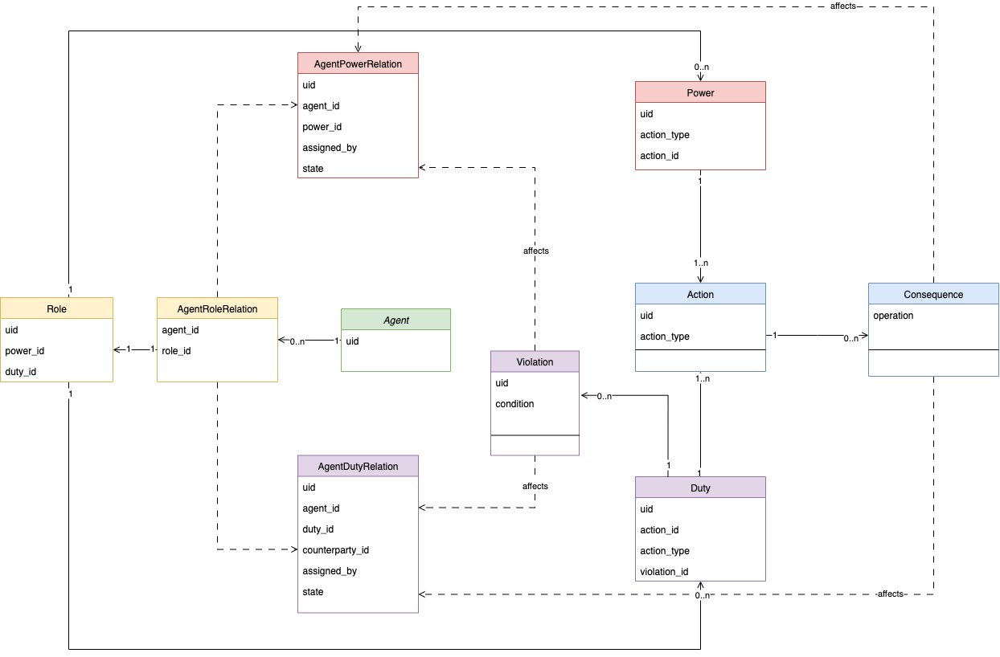
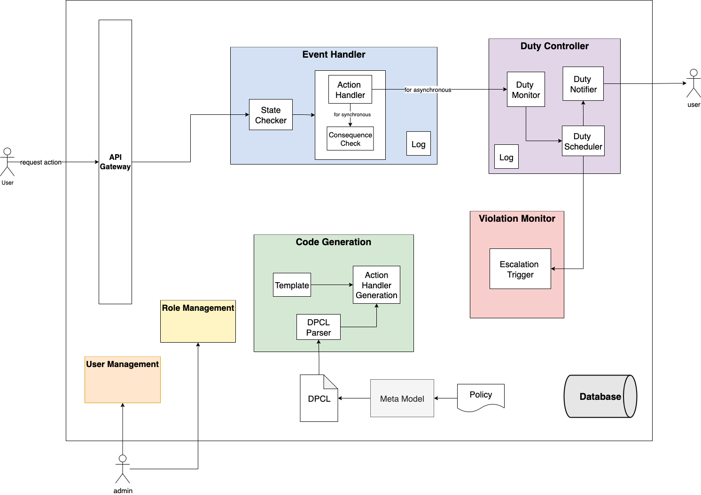
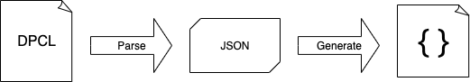
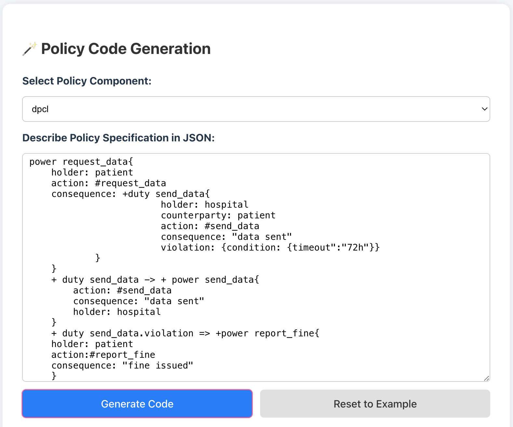
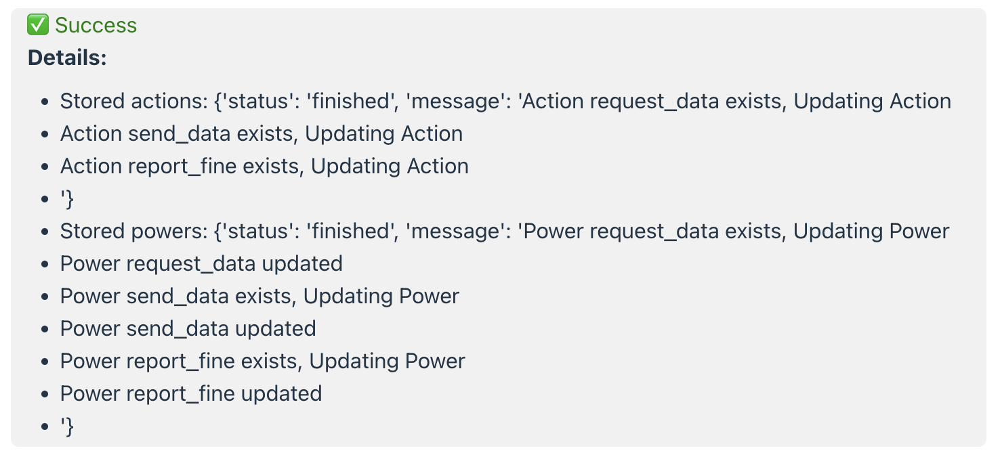
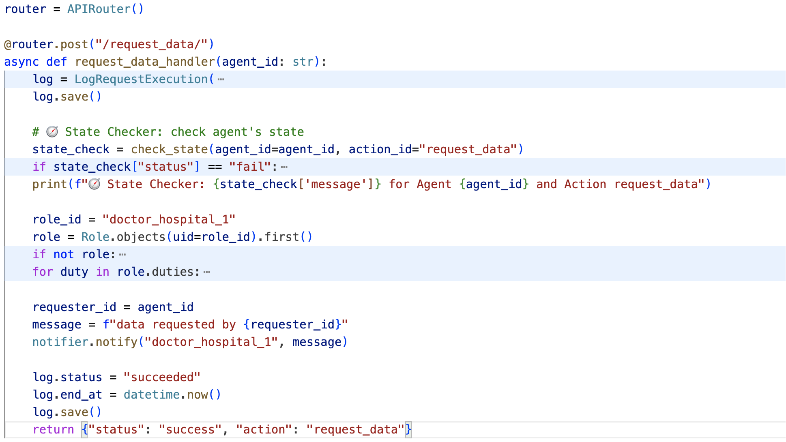

# Code Generation of Microservices based on Policies

## Meta Model

The **meta model** illustrates how policies are structurally represented in our system, based on the [DPCL](https://arxiv.org/abs/2201.04477) framework. It captures the core normative constructs and operational semantics required for policy-driven microservice generation. defines the core policy entities and their relations that inform the behavior of generated services.

This model incorporates the following key features:

1. **Event-Driven Semantics**  
   Actions serve as event triggers. Once an action is performed, its consequence dynamically updates the system's state by modifying `agentPowerRelation` and/or `agentDutyRelation`.

2. **Role-Based Structuring**  
   Agents operate within roles. Initially, powers and duties are derived from `agentRoleRelation`. These normative positions are then materialized into `agentPowerRelation` and `agentDutyRelation`, grounding execution on role-based access control principles.

3. **Violation Monitoring and Propagation**  
   Duties are monitored for violations. When a duty is violated, it can lead to further normative consequences, such as revoking powers or triggering new obligations, thus altering the state of both `agentPowerRelation` and `agentDutyRelation`.

  
*Figure 1: Abstract meta model structure based on DPCL, highlighting key normative relations and their operational triggers.*


## Policy Patterns & Enforcement Patterns

This section categorizes how policies are operationalized through enforcement mechanisms, with clear mapping between logic, enforcement strategy, and examples using DPCL.


### Enforcement Patterns Overview

| Enforcement Pattern         | Description                                                                                      |
|----------------------------|--------------------------------------------------------------------------------------------------|
| **Event-Driven Enforcement** | Action-triggered rules. Performing an action triggers immediate execution of consequences.       |
| **Check-Point Validation**  | Pre-execution checks based on Power-Duty alignment. Used to allow or deny an action.             |
| **Post-Execution Check**    | Escalation or consequence triggered after execution, usually due to duty violation.              |
| **Pre-Condition Check**     | Applies to transformational rules: if precondition holds, a consequence is activated.            |


###  Power-Duty Checkpoint Matrix

A simplified access control matrix that determines whether an action is allowed based on the power and duty configuration.

| Action  | ✅ Power | ❌ Power |
|------------|----------|----------|
| ✅ Duty        | Allowed  | Post-check possible |
| ❌ Duty        | Allowed  | **Prohibited**      |


###  Policy Enforcement Patterns

#### 1. **Explicit Enablement**

- **Logic**: Grant power → action becomes permitted
- **Pattern**: Check-Point Validation
- **Trigger**: User request → validation → execution

```
DPCL Example:

power log_access {
  holder: patient
  action: #log_access
  consequence: "log success"
}
```
#### 2. Explicit Disablement (Static Prohibition)
- **Logic**: A static condition disables power in advance

- **Pattern**: Pre-execution Denial

```
DPCL Example

user not in patient => -power log_access
```

#### 3. Implicit Disablement / Violation-Triggered Escalation
- **Logic**: Post-execution validation → reaction

- **Pattern**: Post-execution Check

- **Property**: Fulfillment or violation of duty dynamically affects future powers

```
DPCL Example:

+ duty send_data.violation => +power report_fine {
  holder: patient
  action: #report_fine
  consequence: "fine issued"
}
```

#### 4. Reactive Rule (Chained Power Activation)

- **Logic**:  
  - Event A triggers creation of Power B  
  - Violation of Duty A triggers Power B  
- **Pattern**: Event-Driven + Escalation (Power Propagation)  
- **Property**: Dynamically creates new normative positions (power/duty)  

```
DPCL Example:

power send_data {
  holder: doctor
  action: #send_data
  consequence: +power log_access {
    holder: patient
    action: #log_access
    consequence: "log success"
  }
}
+ duty send_data.violation => +power report_fine {}
```

#### 5. Transformational Rule
- **Logic**:  If A holds → then B holds

- **Pattern**: Pre-condition Check

- **Use Case**: Institutional transformation; policy rule changes state

```
DPCL Example:

+ duty send_data -> + power send_data {
  holder: hospital
}

- duty send_data -> - power send_data {
  holder: hospital
}
```

#### Combined Example
```
power request_data {
  holder: patient
  action: #request_data
  consequence: +duty send_data {
    holder: hospital 
    counterparty: patient 
    action: #send_data 
    consequence: "data sent"
    violation: { condition: { "timeout": "72h" } }
  }
}

+ duty send_data -> + power send_data {
  holder: hospital
}

+ duty send_data.violation => +power report_fine {
  holder: patient 
  action: #report_fine
  consequence: "fine issued"
}
```
These enforcement patterns enable policy transformation into executable microservices by connecting normative logic with action life-cycles and system behavior.

## Architecture Component Description

This section explains how the policy-based code generation pipeline is structured and how various enforcement components interact to execute normative directives specified via DPCL.



### Enforcement Features Summary

| Feature | Description |
|--------|-------------|
| **Temporal Obligation** | Duties have associated deadlines. Scheduler tracks time and detects if they are fulfilled in time. |
| **Role-Based Delegation** | Powers and duties are assigned to agents at system initialization based on roles. |
| **Declarative Power/Duty + Instantiation** | Each instance of a power or duty is created from base policy definitions stored in the system. |
| **Template-Based Code Generation** | Action handlers are generated using templates, populated from policy JSON configs. |

---

> These enforcement components ensure that declarative policies are correctly instantiated and executed, while supporting both pre- and post-execution checks, escalation, and lifecycle monitoring of normative tasks.


### Code Generation Pipeline

The policy enforcement system is initialized by parsing DPCL policy descriptions and generating executable components.

**Pipeline:**

```text
DPCL text → DPCL Parser → JSON Config File → Store policy components → Generate Action Handlers
```


#### Example: 
`DPCL` to `policy components`:

**Input**:

**Output**:


`JSON` config for `request_data` Handler:

**Input**:
```json
{
  "action_id": "request_data",
  "action_type": "request_data",
  "operation": [
    {
      "type": "activate_duty",
      "parameter": {
        "duty_id": "send_data",
        "counterparty_role_id": "doctor_hospital_1"
      }
    },
    {
      "type": "rules",
      "rules": {
        "state": { "type": "duty", "id": "send_data", "operation": "activate" },
        "leads_to": { "type": "power", "id": "send_data", "operation": "activate" }
      }
    }
  ]
}
```
**Output**:


>The generated action handler uses this JSON configuration and a Jinja2-like template to produce executable code (e.g., FastAPI endpoint) corresponding to the normative action.


###  Enforcement Architecture

####  StateChecker

A runtime module to validate whether an agent can perform a certain action.

| Action  | ✅ Power | ❌ Power |
|---------------|----------|----------|
| ✅ Duty        | Allowed  | Post-check possible |
| ❌ Duty        | Allowed  | **Prohibited**      |

**Features:**

- Verifies whether the agent is **authorized** to execute a requested action.
- If a `duty_ref` is provided:
  - Confirms the associated duty task is **assigned**, **pending**, and **matches the agent**.
- If no `duty_ref` is given:
  - Checks the agent’s **agentPowerRelation** or **agentDutyRelation** to validate authority.

---
####  Duty Monitor

Handles lifecycle tracking of duty tasks.

<!-- **Responsibilities:** -->

- Listen to `DutyLog` updates.
- Add new tasks to the `DutyTaskList`.
- Assign deadlines to instantiated duties.
- Reactively update state according to **transformational rules**.
- Notify `Escalation Trigger` on violations.

---

####  Duty Scheduler

A time-aware enforcement daemon for monitoring and violation detection.

<!-- **Responsibilities:** -->

- Periodically evaluate `DutyTaskList`.
- Trigger **violations** when deadlines are exceeded.
- Notify `Escalation Trigger`.

---

####  Escalation Trigger

- Executes **post-execution policies** when violations are detected.
- Example: Trigger fine/reporting powers based on a violated duty.


## Policy Enforcement Flow

The following sequence diagram illustrates the end-to-end process of **policy-aware action execution and duty enforcement** in the system. It demonstrates how user requests are checked, executed, and monitored in accordance with declarative policies defined in **DPCL**.

- The user initiates a request, optionally with a `duty_ref`.
- The **StateChecker** validates whether the agent has sufficient power or a valid duty to execute the action(according to power-duty matrix).
- If authorized, the **ActionHandler** executes the action and applies both **synchronous** and **asynchronous** consequences.
- Synchronous consequences update the system state (e.g., `agentPowerRelation`, `agentDutyRelation`) in the **Database**.
- If the action was tied to a duty, its status is updated accordingly (e.g., to `fulfilled`).
- Asynchronous consequences are handled by the **DutyMonitor**, which registers new duty tasks in the **DutyTaskList**.
- The **DutyScheduler** periodically checks for overdue duties and informs the **ViolationMonitor** if a duty has been violated.
- Upon detecting a violation, the system records it, potentially revokes powers, and notifies the affected agent(s).

This architecture supports both **pre- and post-condition enforcement**, **role-based delegation**, and **temporal obligation tracking**, enabling fine-grained, event-driven policy enforcement in **microservice environments**.


*Figure: Sequence diagram of policy-driven action execution and duty enforcement. It shows the full lifecycle from user request validation through action execution, consequence propagation, duty scheduling, and violation monitoring within a microservice-based architecture.*